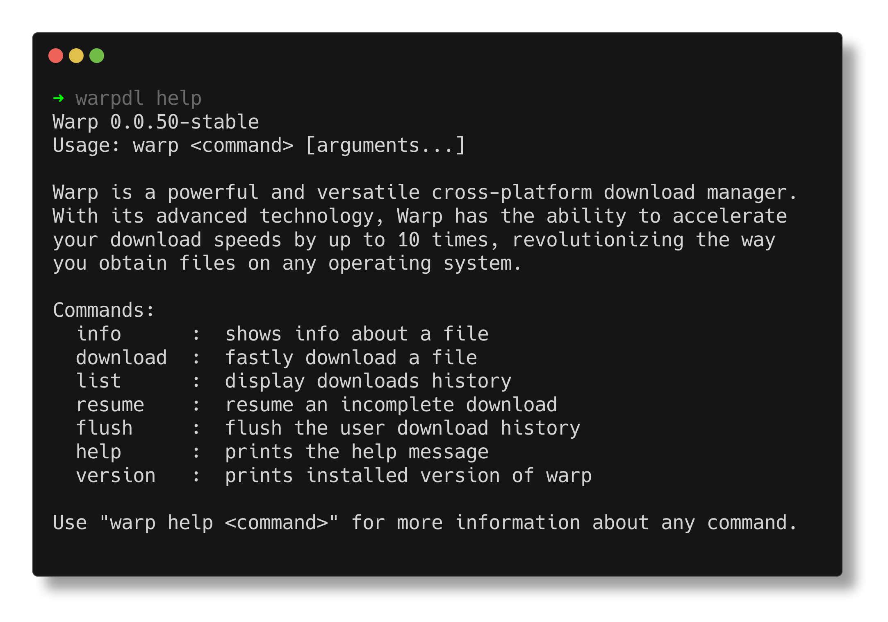

<br/>
<p align="center">
  <a href="https://github.com/warpdl/warpdl">
    
  </a>

  <h3 align="center">WarpDL</h3>

  <p align="center">
    A powerful and versatile cross-platform download manager.
    <br/>
    <br/>
    <a href="https://github.com/warpdl/warpdl/issues">Report Bug</a>
    .
    <a href="https://github.com/warpdl/warpdl/issues">Request Feature</a>
  </p>
</p>

<div align="center">

[](https://github.com/warpdl/warpdl/actions/workflows/ci.yml) [](https://github.com/warpdl/warpdl/actions/workflows/release.yml)

    [](https://cloudsmith.com)

</div>

**Note**: This branch is the development branch.

## Table Of Contents

* [About the Project](#about-the-project)
* [Getting Started](#getting-started)
  * [Prerequisites](#prerequisites)
  * [Installation](#installation)
  * [Uninstallation](#uninstallation)
* [Usage](#usage)
* [Roadmap](#roadmap)
* [Contributing](#contributing)
* [License](#license)

## About The Project



Warp is a powerful and versatile cross-platform download manager. With its advanced technology, Warp has the ability to accelerate your download speeds by up to 10 times, revolutionizing the way you obtain files on any operating system.

### Platform Support

| Platform | Support Level | Notes |
|----------|--------------|-------|
| Linux | Full | Tested on CI, native packages (deb/rpm) |
| macOS | Full | Tested on CI, Homebrew available |
| Windows | Best Effort | Builds provided, not tested on CI |
| FreeBSD/OpenBSD/NetBSD | Best Effort | Builds provided |

**Windows users:** Binaries are provided via [Releases](https://github.com/warpdl/warpdl/releases) and Scoop. Core functionality works, but Windows-specific bugs should be reported via [issues](https://github.com/warpdl/warpdl/issues).


## Getting Started

Although WarpDL can be installed using various package managers, but you can also build it manually.

### Prerequisites

You will need the following things for building warpdl binary:

* This Repository - clone it using the following command:
   ```git clone https://github.com/warpdl/warpdl```
* Go v1.18+ - You can download it from [go.dev/dl](https://go.dev/dl).

### Installation

#### Quick Install (Recommended)

```bash
curl -fsSL https://raw.githubusercontent.com/warpdl/warpdl/dev/scripts/install.sh | sh
```

This automatically:
- **Linux (Debian/Ubuntu/Fedora/RHEL):** Sets up Cloudsmith repo for auto-updates + systemd service
- **macOS/BSD:** Downloads binary directly (suggests Homebrew)
- **Windows (Git Bash):** Downloads binary directly (suggests Scoop)

#### Alternative Methods

<details>
<summary>Homebrew (macOS)</summary>

```bash
brew install warpdl/tap/warpdl
```
</details>

<details>
<summary>Scoop (Windows)</summary>

```bash
scoop bucket add warpdl https://github.com/warpdl/scoop-bucket
scoop install warpdl
```
</details>

<details>
<summary>Manual Package Manager Setup</summary>

**Debian/Ubuntu:**
```bash
curl -1sLf 'https://dl.cloudsmith.io/public/warpdl/warpdl/setup.deb.sh' | sudo bash
sudo apt install warpdl
```

**Fedora/RHEL/CentOS:**
```bash
curl -1sLf 'https://dl.cloudsmith.io/public/warpdl/warpdl/setup.rpm.sh' | sudo bash
sudo dnf install warpdl
```
</details>

<details>
<summary>Binary Only (no repo setup)</summary>

```bash
curl -fsSL https://raw.githubusercontent.com/warpdl/warpdl/dev/scripts/install.sh | sh -s -- --no-repo
```
</details>

<details>
<summary>Build from Source</summary>

1. Clone the repository:
   ```bash
   git clone https://github.com/warpdl/warpdl
   cd warpdl
   ```

2. Build:
   ```bash
   go mod tidy
   go build -ldflags="-s -w" .
   ```

3. Add the binary to your `PATH`.
</details>

<details>
<summary>Manual Download</summary>

Download binaries from the [Releases](https://github.com/warpdl/warpdl/releases/latest) page. Available for macOS, Linux, Windows, FreeBSD, OpenBSD, and NetBSD across multiple architectures.

**macOS Gatekeeper:** If you download directly (not via Homebrew), macOS may block the binary. Run:
```bash
xattr -cr /path/to/warpdl
```
</details>

### Optional: Enable Systemd User Service

WarpDL can optionally run as a systemd user service for auto-start on login:

```bash
# Reload systemd user daemon to discover new service
systemctl --user daemon-reload

# Enable and start the service
systemctl --user enable --now warpdl.service

# Check status
systemctl --user status warpdl.service

# View logs
journalctl --user -u warpdl.service
```

For servers (start at boot without login):
```bash
sudo loginctl enable-linger $USER
```

Note: The systemd service is optional. WarpDL daemon auto-starts when needed for regular CLI usage.

### Uninstallation

The WarpDL daemon runs in the background to manage downloads. Before uninstalling, stop the daemon first.

- **Homebrew:**
  ```
  brew uninstall warpdl
  ```
  Note: The daemon is automatically stopped during uninstallation.

- **Scoop:**
  ```
  scoop uninstall warpdl
  ```
  Note: The daemon is automatically stopped during uninstallation.

- **Script/Manual Installation:**
  ```
  curl -fsSL https://raw.githubusercontent.com/warpdl/warpdl/dev/scripts/uninstall.sh | sh
  ```

- **Complete Manual Cleanup:**
  ```bash
  # Stop the daemon
  warpdl stop-daemon

  # Remove the binary (path may vary)
  sudo rm $(which warpdl)

  # Remove configuration and download data
  rm -rf ~/.config/warpdl
  ```

## Usage

Use `warpdl help <command>` for information about various commands.

## Roadmap

See the [open issues](https://github.com/warpdl/warpdl/issues) for a list of proposed features (and known issues).

## Contributing

Contributions are what make the open source community such an amazing place to be learn, inspire, and create. Any contributions you make are **greatly appreciated**.
* If you have suggestions for adding or removing features, feel free to [open an issue](https://github.com/warpdl/warpdl/issues/new) to discuss it, or directly create a pull request after you edit the *README.md* file with necessary changes.
* Please make sure you check your spelling and grammar.
* Create individual PR for each suggestion.

### Creating A Pull Request

1. Fork the Project
2. Create your Feature Branch (`git checkout -b feature/AmazingFeature`)
3. Commit your Changes (`git commit -m 'Add some AmazingFeature'`)
4. Push to the Branch (`git push origin feature/AmazingFeature`)
5. Open a Pull Request

## License

Distributed under the MIT License. See [LICENSE](https://github.com/warpdl/warpdl/blob/dev/LICENSE) for more information.

## Acknowledgements
Package repository hosting is graciously provided by https://cloudsmith.com.
