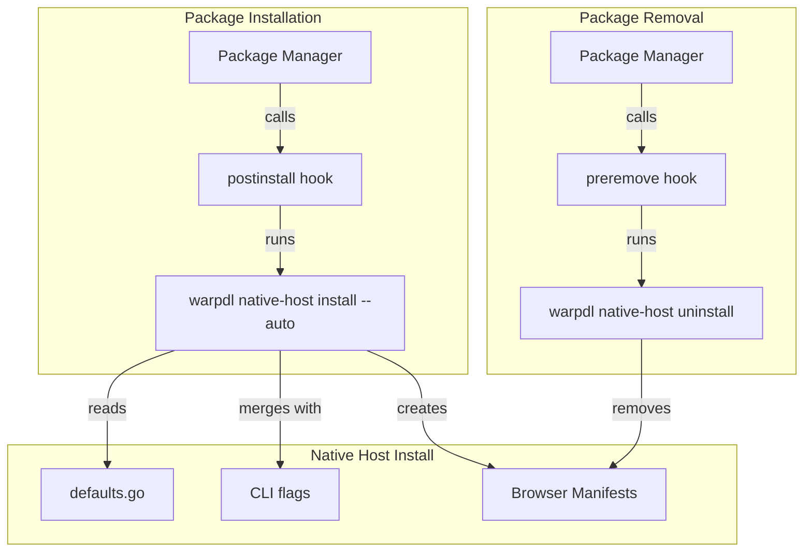

# Design: Auto-install Native Messaging Host via Package Manager Hooks

## Overview

Add default extension IDs to nativehost package, modify CLI to use them, and update all package manager hooks to automatically install/uninstall native messaging manifests.

## Architecture



## Components

### Component: defaults.go

**Purpose**: Centralize official extension IDs

**Location**: `internal/nativehost/defaults.go`

**Structure**:
```go
package nativehost

const (
    // OfficialChromeExtensionID is the Chrome Web Store extension ID.
    // TODO: Set after publishing to Chrome Web Store
    OfficialChromeExtensionID = ""

    // OfficialFirefoxExtensionID is the Firefox Add-ons extension ID.
    // TODO: Set after publishing to Firefox Add-ons
    OfficialFirefoxExtensionID = ""
)

// HasOfficialExtensions returns true if at least one official ID is configured.
func HasOfficialExtensions() bool {
    return OfficialChromeExtensionID != "" || OfficialFirefoxExtensionID != ""
}
```

### Component: Modified install.go

**Purpose**: Use defaults when flags not provided, add `--auto` flag

**Changes**:
1. Check defaults when flags empty
2. Add `--auto` flag for silent operation
3. In auto mode: succeed silently if no IDs available

### Component: Homebrew Formula Hook

**Purpose**: Auto-install native host on brew install

**Pattern**: Ruby in `.goreleaser.yml` brews section

### Component: Scoop Manifest Hook

**Purpose**: Auto-install native host on scoop install

**Pattern**: PowerShell in patched manifest JSON

### Component: DEB/RPM Scripts

**Purpose**: Auto-install/uninstall on Linux package operations

**Pattern**: POSIX sh scripts

## Data Flow

1. User runs `brew install warpdl` / `scoop install warpdl` / `apt install warpdl`
2. Package manager installs binary to standard location
3. Post-install hook executes `warpdl native-host install --auto`
4. CLI reads defaults from `defaults.go`
5. CLI merges with any environment/flag overrides
6. If IDs available: install manifests to browser-specific directories
7. If no IDs: exit 0 silently (auto mode)

## Technical Decisions

| Decision | Options | Choice | Rationale |
|----------|---------|--------|-----------|
| Default storage | Constants vs config file | Constants | Simpler, compile-time, no runtime deps |
| Auto flag behavior | Warn vs silent | Silent | Package hooks should not spam |
| Hook failure handling | Fail vs continue | Continue | Installation shouldn't break on optional feature |
| ID merge strategy | Replace vs append | Replace | Custom IDs likely want exclusive access |

## File Structure

| File | Action | Purpose |
|------|--------|---------|
| `internal/nativehost/defaults.go` | Create | Store official extension IDs |
| `internal/nativehost/defaults_test.go` | Create | Test HasOfficialExtensions |
| `cmd/nativehost/install.go` | Modify | Use defaults, add --auto flag |
| `cmd/nativehost/cmd.go` | Modify | Add --auto flag definition |
| `.goreleaser.yml` | Modify | Add native host to Homebrew post_install/post_uninstall |
| `scripts/patch-scoop-manifest.sh` | Modify | Add native host to post_install |
| `scripts/postinstall.sh` | Modify | Add native host install call |
| `scripts/preremove.sh` | Modify | Add native host uninstall call |

## CLI Changes

### New Flag

```
--auto    Enable automatic/silent mode for package manager hooks (no error on missing IDs)
```

### Modified Behavior

| Scenario | Current | New |
|----------|---------|-----|
| No flags, no defaults | Error: extension ID required | Error (same) |
| No flags, defaults exist | Error | Use defaults, success |
| No flags, auto mode | N/A | Exit 0 silently |
| Flags provided | Use flags | Use flags (unchanged) |

## Hook Scripts

### Homebrew (Ruby)

```ruby
post_install: |
  # Stop daemon from previous version
  begin
    system "#{bin}/warpdl", "stop-daemon"
  rescue
  end

  # Install native messaging host for browser extension
  begin
    system "#{bin}/warpdl", "native-host", "install", "--auto"
  rescue
    # Non-fatal: extension IDs may not be configured yet
  end

post_uninstall: |
  # Remove native messaging manifests
  begin
    system "#{bin}/warpdl", "native-host", "uninstall", "--browser", "all"
  rescue
  end
```

### Scoop (PowerShell)

```json
{
  "post_install": [
    "& \"$dir\\warpdl.exe\" native-host install --auto 2>$null"
  ],
  "pre_uninstall": [
    "& \"$dir\\warpdl.exe\" native-host uninstall --browser all 2>$null",
    "# existing daemon stop code..."
  ]
}
```

### DEB/RPM (POSIX sh)

```sh
# In postinstall.sh - add after existing content
if command -v warpdl >/dev/null 2>&1; then
    warpdl native-host install --auto 2>/dev/null || true
fi

# In preremove.sh - add before daemon stop
if command -v warpdl >/dev/null 2>&1; then
    warpdl native-host uninstall --browser all 2>/dev/null || true
fi
```

## Error Handling

| Error | Handling | User Impact |
|-------|----------|-------------|
| No extension IDs (auto mode) | Exit 0 | None, silent |
| No extension IDs (normal mode) | Exit 1 with message | User sees error |
| Manifest directory creation fails | Log error, continue | Partial install |
| Manifest write fails | Log error, continue | Partial install |
| Uninstall of non-existent manifest | Exit 0 | None |

## Existing Patterns to Follow

- Error handling pattern from `scripts/preremove.sh` (always exit 0, use `|| true`)
- Ruby try/rescue pattern from `.goreleaser.yml` post_install
- PowerShell error suppression from `scripts/patch-scoop-manifest.sh`
- Flag definition pattern from `cmd/nativehost/cmd.go`

## Testing Strategy

| Test | Type | Coverage |
|------|------|----------|
| HasOfficialExtensions with empty IDs | Unit | defaults.go |
| HasOfficialExtensions with Chrome ID | Unit | defaults.go |
| HasOfficialExtensions with Firefox ID | Unit | defaults.go |
| Install with auto flag, no IDs | Integration | install.go |
| Install with auto flag, with IDs | Integration | install.go |
| Install with explicit flags | Integration | install.go (existing) |
