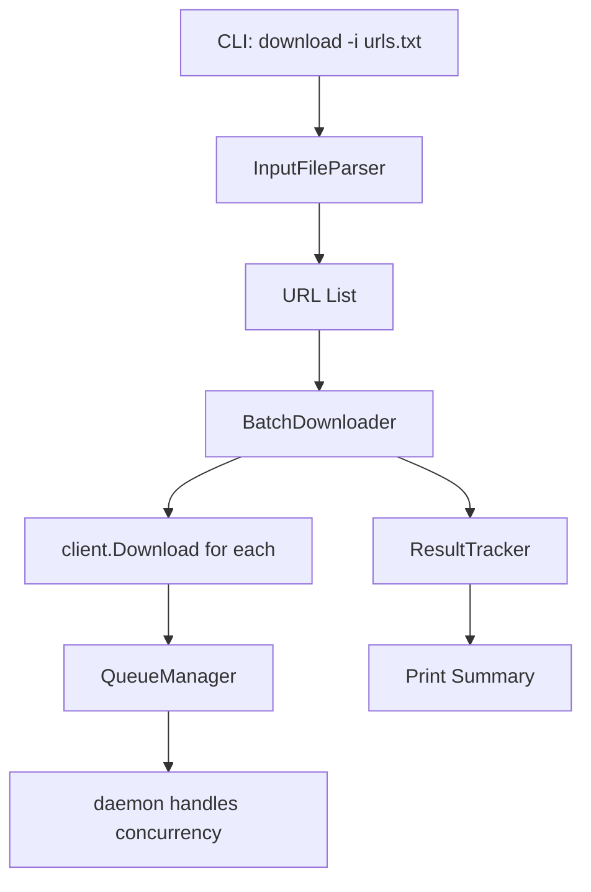

# Design: Batch URL Download from Input File

## Overview

Add input file parsing layer to download command. Parse file, collect URLs, queue each via existing download flow. Track results for summary.

## Architecture



## Components

### Component A: InputFileParser
**Location**: `cmd/input_file.go` (new file)

**Purpose**: Parse input file into URL list

**Responsibilities**:
- Read file line by line
- Skip comments (`#`) and empty lines
- Trim whitespace
- Validate URL format (basic check)
- Return `[]ParsedURL` or error

**Interface**:
```go
type ParsedURL struct {
    URL      string
    LineNum  int  // For error reporting
}

type ParseResult struct {
    URLs   []ParsedURL
    Errors []ParseError  // Non-fatal parse warnings
}

func ParseInputFile(path string) (*ParseResult, error)
```

### Component B: BatchDownloader
**Location**: `cmd/download.go` (extend existing)

**Purpose**: Orchestrate batch download flow

**Responsibilities**:
- Collect URLs from input file + args
- Call `client.Download()` for each
- Track success/failure counts
- Print summary

**Interface**:
```go
type BatchResult struct {
    Succeeded int
    Failed    int
    Errors    []BatchError
}

type BatchError struct {
    URL    string
    Reason string
}

func downloadBatch(client *warpcli.Client, urls []ParsedURL, opts *DownloadOpts) *BatchResult
```

### Component C: ResultTracker
**Location**: Embedded in `BatchDownloader`

**Purpose**: Aggregate download results

**Responsibilities**:
- Count successes
- Collect failures with reasons
- Format summary output

## Data Flow

1. User runs `warpdl download -i urls.txt`
2. CLI parses `-i` flag, reads file path
3. `ParseInputFile()` returns URL list
4. If direct URL args exist, append to list
5. For each URL: call `client.Download()`
6. Track result (success/error)
7. After all queued, print summary
8. If not `--background`, attach to first download

## Technical Decisions

| Decision | Options | Choice | Rationale |
|----------|---------|--------|-----------|
| Parser location | warplib vs cmd | cmd | CLI-only feature, not needed in daemon |
| Parse strategy | Full file vs streaming | Full file | Simpler, URLs.txt typically small |
| Error handling | Fail fast vs continue | Continue | User expectation for batch ops |
| URL validation | Strict vs permissive | Permissive | Let daemon validate, report errors |

## File Structure

| File | Action | Purpose |
|------|--------|---------|
| `cmd/input_file.go` | Create | Input file parser |
| `cmd/input_file_test.go` | Create | Parser unit tests |
| `cmd/download.go` | Modify | Add `-i` flag, batch logic |
| `cmd/download_batch_test.go` | Create | Batch download tests |

## Error Handling

| Error | Handling | User Impact |
|-------|----------|-------------|
| File not found | Return error, abort | "Error: input file not found: /path/to/file" |
| File permission denied | Return error, abort | "Error: cannot read input file: permission denied" |
| Invalid URL in file | Log warning, skip | "Warning: skipping invalid URL at line 5: [url]" |
| Download error | Log, continue batch | "Failed: [url] - [reason]" in summary |
| Empty file | No-op, warn | "Warning: input file is empty" |

## CLI Flag Design

```go
// Add to dlFlags in cmd/download.go
cli.StringFlag{
    Name:  "input-file, i",
    Usage: "read URLs from file (one per line, # for comments)",
},
```

## Existing Patterns to Follow

| Pattern | File | Usage |
|---------|------|-------|
| Flag definition | `cmd/download.go:22-56` | `cli.StringFlag` in `dlFlags` |
| Error printing | `cmd/common/error.go` | `PrintRuntimeErr()` |
| Line parsing | `cmd/cookie_parser.go` | Trim, validate, collect |
| Test patterns | `cmd/cookie_parser_test.go` | Table-driven tests |

## Integration with Existing Code

### download() function changes

```go
func download(ctx *cli.Context) error {
    inputFile := ctx.String("input-file")
    directURL := ctx.Args().First()

    // Case 1: Neither input file nor URL
    if inputFile == "" && directURL == "" {
        return cmdcommon.PrintErrWithCmdHelp(ctx, errors.New("no URL or input file provided"))
    }

    // Case 2: Input file mode (may also have direct URLs)
    if inputFile != "" {
        return downloadFromInputFile(ctx, inputFile)
    }

    // Case 3: Single URL mode (existing behavior)
    return downloadSingleURL(ctx, directURL)
}
```

### Batch mode summary output

```
Batch download complete
  Succeeded: 8
  Failed: 2

Failed downloads:
  - https://example.com/broken.zip: 404 Not Found
  - https://invalid-url: invalid URL format
```
